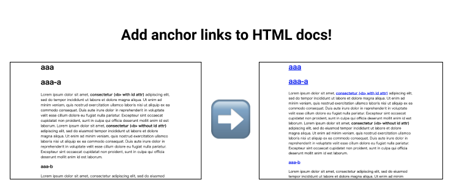

# add-anchor-links-to-html



Add `<a href=#hello>...</a>` to html elements with `id=hello`.

```sh
$ go get -u github.com/iwasa-kosui/add-id-links-to-html
$ cat example.html
<html><head>
    
</head>
<body>
<div class="post">
    <h1 id="aaa">aaa</h1>
    <h3 id="bbb">bbb</h3>
</div>
</body></html>

# outputs the result
$ ./add-id-links-to-html -i example.html
<html><head>
    
</head>
<body>
<div class="post">
    <a href="#aaa"><h1 id="aaa">aaa</h1></a>
    <a href="#bbb"><h3 id="bbb">bbb</h3></a>
</div>
</body></html>

# saves to the file
$ ./add-id-links-to-html -i example.html -o output.html
```

## Motivation

When I convert .epub to .html with pandoc, I get a very long html document.
After reading some sections in it, I want to suspend reading and remember which chapter to start reading tomorrow.
However, the exported html doc does not have anchor links...
Thus, I add them to html with the script.
